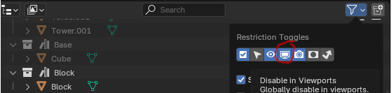
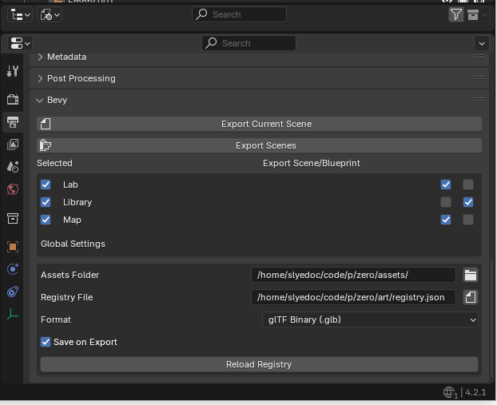

# Sparrow

This is my take on [Blenvy](https://github.com/kaosat-dev/Blenvy) and you should go use it most likely.
This repo also includes source from [Auto Bake](https://blendermarket.com/products/autobake) since most materials in Blender will need to be baked for gltf export and use in bevy.

> This is a cursed workflow, having to move data from Blender -> Gltf -> Bevy leaves you needing to have decent understanding of all 3 to have a chance at debugging issues.  It's a house of card for the most part, we would be better off building and editor in bevy in the long run.  This is my second attempt and I still have issues with it and can't recommend it to anyone else.

## TODO

- [ ] Docs
- [ ] Examples
- [X] Fake Entity - based on [DasLixou's pr](https://github.com/kaosat-dev/Blenvy/pull/236)
  - This does work, is a bit error prone, 
  - [ ] add flatten back
- [ ] Hot reloading registry file
  - workaround: Restart Blender
- [ ] Component - Hooks and Require Component
  - With hooks and observers, it's possible to have bevy add a component, that expected other component, but the other component hasn't been added yet, require component will only make this worse
- [ ] Component Changes
  - If a component changes it currently breaks on any things that was using it, so move a component to new file, and you broke everything that was using it 
  - workaround: remove it and re-add it, log tells you any components in this stay
- [ ] Better 'world' shader export
  - see [The_Lightmapper](https://github.com/Naxela/The_Lightmapper/)
- [ ] Texture Deduplication
  - gltf handles dedup of textures with in a single file, but io_scene_gltf2 doesn't support exporting multiple 'blender' scenes, so you end up with a lot of duplicated textures in blueprints currently, blowing up gpu memory usage and load times, make go back to how blenvy handled this but I hate having gltf files what require other gltf files to work
- [X] Components on Scene, Collection, and Objects
- [X] Collection Instances as bluerprints, requires collection be marked as asset to flag as "blueprint"

## Notes

> _Tip_: To disable something from export you can enable Global Viewport Display
> 
> and disable it for your object, really useful for when you have baked and normal version, and want to keep both around

All settings are in the Properties Panel under different tabs:

-Render
  - Sparrow - Auto Bake
    - (straight copy of Auto Bake), haven't modified it much, see [Docs](https://blendermarket.com/products/autobake/docs)
- Output
  - Bevy 
  - Setup the asset folder and registry file

  - Choose what Scenes you want to export, each can have the scene its self or the blueprints in the scene, meaning collections marked as asset, or both
  - Trigger export with `Export Scenes` or `Export Current Scene`
  - > Tip: add 'Current Scene' and 'Export Scenes' to you quick menu so trigger them with `Q` from anywhere
  - >Note: There is no export on save, only save on export, to many times you want to save before doing something in blender when you don't really want to export
- Scene
  - Bevy Components
- Collection
  - Bevy Components
- Object
  - Bevy Components

## Features

| Feature | Use |
| --- | --- |
| registry | Will export a registry file at startup |
| animation | Will setup animations clips and start first on load |
| reload | Will reload scene on asset change |

## License

Blender plugin is licensed under the GPL v3 license (like all blender plugins).

Bevy Plugin is licensed under the MIT or Apache 2.0 license.